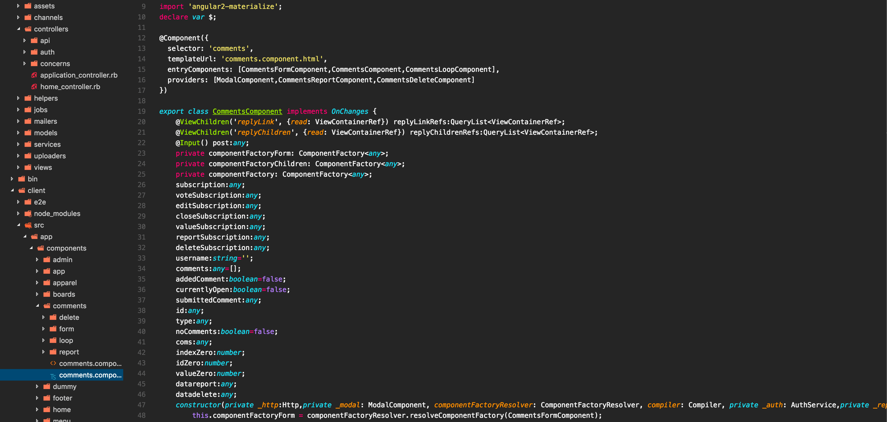

# README

This is basically a VSC port of the Monokai - Gray color scheme, and predawn-DEV theme made for Sublime Text.

The icon theme is based off Qinjia's Seti icons, and the color theme is based off Bogdan Sinitsa's Monokai - Dark theme. 



### To Add:

Copy both folders into ~/.vsc/extensions

Select the Seti icons in the 'file icon theme' and the Dark (Monokai) in the 'color theme' found in VSC.

### Other Configs:
```
{
    "editor.fontSize": 13,
    "editor.renderLineHighlight": false
}
```